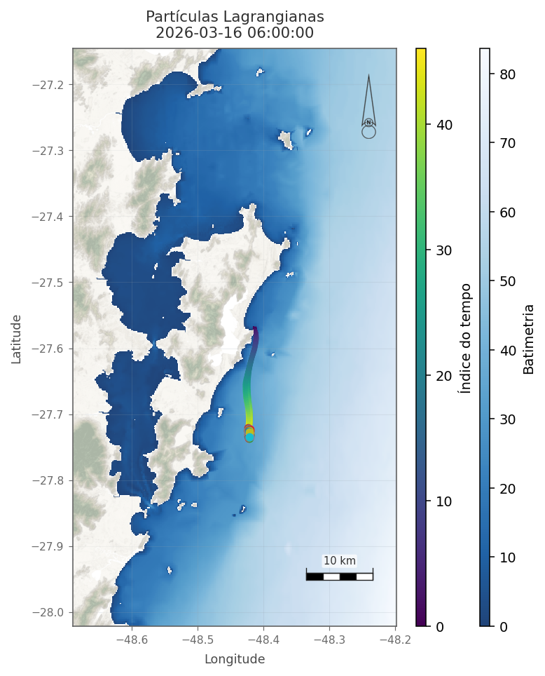

# MOHID Lagrangian and Properties Maps

Python tool for inspecting and plotting MOHID Lagrangian particle and properties outputs stored in HDF5 files.

It is designed for quick scientific visualization with optional bathymetry and local DEM/topography support, plus export of static maps and animations.

## Example



## Features

- automatic discovery of particle coordinate groups in MOHID-style HDF5 files
- trail visualization with time-colored trajectories
- quick HDF5 inspection mode
- bathymetry support from HDF5, NetCDF, CSV, TXT, or XYZ
- local DEM/topography support from raster files
- north arrow, scale bar, and cartographic finishing
- export to PNG, frame sequences, GIF, and MP4

## Project Structure

- `main.py`: unified CLI with `lagrangian` and `fields` subcommands
- `config.py`: project defaults
- `src/lagrangian.py`: lagrangian particle maps
- `src/fields.py`: hydrodynamic and water-quality fields
- `src/lagrangian_cli.py`: lagrangian command-line interface
- `src/lagrangian_processing.py`: lagrangian data loading and inspection
- `src/lagrangian_rendering.py`: lagrangian figure rendering
- `src/fields_cli.py`: fields command-line interface
- `src/fields_processing.py`: field loading, masking, and limits
- `src/fields_rendering.py`: scalar and vector field rendering
- `src/domain.py`: shared dataset and render context objects
- `src/io_mohid.py`: shared MOHID time/grid utilities
- `src/io_geospatial.py`: shared bathymetry and DEM/topography readers
- `src/cartography.py`: shared map styling, scale bar, north arrow, and terrain overlays
- `src/specs.py`: variable specifications, palettes, and map defaults
- `src/animations.py`: shared animation export helpers
- `assets/cartography/`: cartographic assets such as `NorthArrow.png`
- `assets/topography/`: optional DEM/topography rasters

## Installation

Install the base dependencies:

```bash
pip install -r requirements.txt
```

Optional packages:

- `pandas` for CSV/XYZ bathymetry
- `xarray` for NetCDF bathymetry
- `rasterio` for DEM/topography rasters

Example:

```bash
pip install pandas xarray rasterio
```

## Basic Usage

Unified CLI:

```bash
python3 main.py lagrangian Lagrangian_1.hdf5 --save mapa.png
python3 main.py fields WaterProperties_2.hdf5 --temp --layer 0 --save temperatura.png
```

Inspect the structure of a MOHID HDF5 file:

```bash
python3 main.py lagrangian Lagrangian_1.hdf5 --inspect
```

Show the latest frame:

```bash
python3 main.py lagrangian Lagrangian_1.hdf5 --show
```

Save a single map:

```bash
python3 main.py lagrangian Lagrangian_1.hdf5 --save mapa.png
```

Save all frames:

```bash
python3 main.py lagrangian Lagrangian_1.hdf5 --save-frames frames
```

Generate an animation:

```bash
python3 main.py lagrangian Lagrangian_1.hdf5 --animate animacao.gif
```

## Hydrodynamic / Water-Quality Fields

Inspect the available variables:

```bash
python3 main.py fields --inspect
```

You can also provide one or more HDF5 files directly in the command line.
This is useful when the files do not use the default names `Hydrodynamic_2.hdf5`
and `WaterProperties_2.hdf5`. The script will inspect the files and use the one
that contains the requested variable in `/Results`.

Example with positional HDF5 files:

```bash
python3 main.py fields Hydrodynamico.hdf5 --curr --save correntes.png
python3 main.py fields WaterProperties_custom.hdf5 --temp --layer 0 --save temperatura.png
```

Available shortcuts:

- `--curr`: currents (`velocity U` + `velocity V` + `velocity modulus`)
- `--wlev`: water level
- `--sali`: salinity
- `--temp`: temperature
- `--oxy`: dissolved oxygen
- `--t90`: T90
- `--ammo`: ammonia
- `--carb`: carbon dioxide
- `--csed`: cohesive sediment
- `--dnrn`: dissolved non-refractory organic nitrogen
- `--dnrp`: dissolved non-refractory organic phosphorus
- `--drrn`: dissolved refractory organic nitrogen
- `--drrp`: dissolved refractory organic phosphorus
- `--ecol`: escherichia coli
- `--fcol`: fecal coliforms
- `--ipho`: inorganic phosphorus
- `--nitr`: nitrate
- `--niti`: nitrite
- `--pon`: particulate organic nitrogen
- `--pop`: particulate organic phosphorus
- `--phyt`: phytoplankton
- `--zoop`: zooplankton

Generate a currents map:

```bash
python3 main.py fields Hydrodynamic_2.hdf5 --curr --save correntes.png
```

Generate a surface salinity map:

```bash
python3 main.py fields WaterProperties_2.hdf5 --sali --layer 0 --save salinidade.png
```

Generate a surface temperature map with DEM tiles:

```bash
python3 main.py fields WaterProperties_2.hdf5 \
  --temp \
  --layer 0 \
  --topography dem_s29_w049.tif dem_s28_w049.tif dem_s27_w049.tif \
  --save temperatura.png
```

The `--topography` option accepts either full paths or just file names.
When only the file name is provided, the project also searches in `assets/topography/`.

List the available times and choose a specific moment:

```bash
python3 main.py fields WaterProperties_2.hdf5 --temp --list-times
python3 main.py fields WaterProperties_2.hdf5 --temp --layer 0 --frame 12 --save temp_frame12.png
python3 main.py fields WaterProperties_2.hdf5 --temp --layer 0 --time "2026-01-31 12:00:00" --save temp_1200.png
```

Generate another variable on demand:

```bash
python3 main.py fields \
  --var phytoplankton \
  --input WaterProperties_2.hdf5 \
  --layer 0 \
  --save fito.png
```

The same command can be written with a positional HDF5 file:

```bash
python3 main.py fields \
  WaterProperties_custom.hdf5 \
  --var phytoplankton \
  --layer 0 \
  --save fito.png
```

Generate one of the additional water-quality variables:

```bash
python3 main.py fields WaterProperties_2.hdf5 --ammo --layer 0 --save amonia.png
python3 main.py fields WaterProperties_2.hdf5 --nitr --layer 0 --save nitrato.png
python3 main.py fields WaterProperties_2.hdf5 --phyt --layer 0 --save fitoplancton.png
```

## Bathymetry Examples

Using an external NetCDF bathymetry file:

```bash
python3 main.py lagrangian Lagrangian_1.hdf5 \
  --bathymetry batimetria.nc \
  --show
```

Using CSV/XYZ bathymetry:

```bash
python3 main.py lagrangian Lagrangian_1.hdf5 \
  --bathymetry batimetria.xyz \
  --show
```

## DEM / Topography Example

Using local DEM tiles together with bathymetry:

```bash
python3 main.py lagrangian Lagrangian_1.hdf5 \
  --bathymetry batimetria.nc \
  --topography dem_s29_w049.tif dem_s28_w049.tif dem_s27_w049.tif \
  --show
```

## Outputs

The script can:

- display the figure interactively
- save a static PNG map
- save a PNG sequence for all time steps
- create GIF or MP4 animations

## Repository Notes

- large scientific input files are ignored by Git
- generated outputs such as maps and animations are ignored by Git
- `assets/cartography/NorthArrow.png` is versioned because it is part of the cartographic layout

## How to Cite

If you use this repository in academic work, reports, or technical documentation, please cite the software repository.

Suggested citation:

```text
Garbossa, L.H.P. MOHID Lagrangian Map. GitHub repository.
Available at: https://github.com/logatz/mohidLagrangianMap
```

GitHub can also generate a citation directly from the `CITATION.cff` file included in this repository.

## License

This project is distributed under the MIT License. See `LICENSE` for details.
